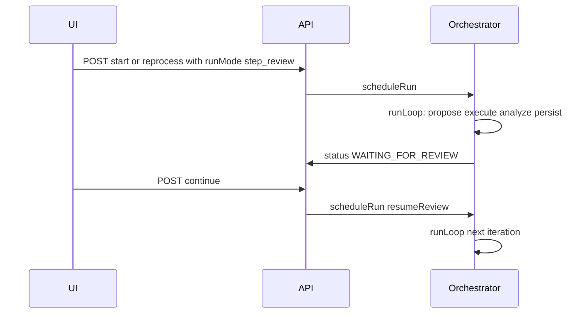

# Evaluation detail: review mode + step inspector UI

## Scope (user request)

- **Normal mode:** current behavior — orchestrator runs steps continuously until finish / cap / human question / failure.
- **Review mode:** after each completed step (post-analyzer, post-persist), the run **pauses** until the user clicks **Continue** (new API resume path).
- **UI:** Below the **Global intent** / **Desired output** card, add a **per-step panel** that updates with the run:
  - **Horizontal scroll** of step “cards” or panels; **breadcrumb** (or step chips) to jump **back/forth** among completed steps (and the “current” step when paused).
  - Per step: **step number**, **step name** (user chose: **new LLM field** `stepTitle` + DB), **activity log before this step** (scrollable), **inputs** to the step, **outputs** returned.
  - **Continue** aligned **top-right** next to breadcrumb (review mode); advances the run and scrolls the strip to show the next step “live” as data arrives (socket + refetch).

## Relationship to earlier README plan

The separate idea of documenting evaluation LLM prompts in [README.md](README.md) is **orthogonal**. Do it in the same or a follow-up PR as desired; this plan does **not** require README changes.

---

## Data model

### `Evaluation`

- Add **`runMode`** (or `evaluationRunMode`): `continuous` | `step_review` (Prisma enum or string enum), default `continuous`.
- Persist so **Start / Re-run** use the same mode without only client state.

### `EvaluationStep`

- **`stepTitle`** `String?` — short label from codegen JSON (user-selected approach).
- **Payload snapshots (recommended)** — store **structured JSON** for the inspector without base64 images:
  - **`codegenInputJson`** — e.g. `{ startUrl, pageUrl, intent, desiredOutput, progressSummaryBefore, priorStepsBrief }` (text only).
  - **`codegenOutputJson`** — e.g. `{ thinking, playwrightCode, expectedOutcome, stepTitle }` (redundant with scalar columns if desired; can normalize later).
  - **`analyzerInputJson`** — e.g. `{ intent, desiredOutput, progressSummary, executedCode, executionOk, errorMessage, pageUrlAfter }`.
  - **`analyzerOutputJson`** — e.g. `{ goalProgress, decision, rationale, humanQuestion?, humanOptions? }`.
- **Rationale:** Full “inputs” the user asked for are reconstructible from orchestrator + `llm.service` templates; persisting snapshots avoids drift and avoids storing screenshots (note in UI: “Viewport JPEG before/after — not stored” or omit).

**Migration:** New Prisma migration under `apps/api/prisma/migrations/`.

### LLM codegen (`evaluationProposePlaywrightStep`)

- Extend **`EVALUATION_CODEGEN_SYSTEM`** JSON template + parsing to require **`stepTitle`** (short human-readable name for this step).
- **`LlmService.evaluationProposePlaywrightStep`** return type includes `stepTitle`; orchestrator passes it into `createStep`.

---

## Backend: orchestrator + API

### Pause / resume (review mode)

- After a step is fully written (including `appendProgressSummary` for that step), if **`runMode === step_review`** and **not** the terminal branch (finish / ask_human / max steps): set **`Evaluation.status`** to a new value **`WAITING_FOR_REVIEW`** (add to `EvaluationStatus` enum), emit `evaluationProgress` with phase e.g. `paused_review`, **return** from `runLoop` (same pattern as `WAITING_FOR_HUMAN`).
- **New endpoint:** e.g. `POST /evaluations/:id/continue-review` (or `POST .../continue` with explicit type) that:
  - Validates `WAITING_FOR_REVIEW`,
  - Sets status `RUNNING`,
  - Calls `scheduleRun(id, userId, { resumeAfterReview: true })` (mirror `resumeAfterHuman`).

### `scheduleRun` / `runLoop` options

- Extend opts: `{ resumeAfterHuman?: boolean; resumeAfterReview?: boolean }`.
- On entry, if `WAITING_FOR_REVIEW` and **not** `resumeAfterReview`, reject or no-op (same as human gate).
- Ensure **only one** of human-pause and review-pause applies at a time (document: `ask_human` takes precedence if both could occur — unlikely in one step).

### Start / reprocess payloads

- **`POST /evaluations/:id/start`** and **`POST /evaluations/:id/reprocess`:** accept optional body `{ runMode?: 'continuous' | 'step_review' }` (or PATCH evaluation before start). Persist on `Evaluation` when starting from `QUEUED` / after `resetForReprocess`.

### DTOs + `findOne`

- Expose `runMode`, `stepTitle`, and JSON payload fields on evaluation step responses in [apps/api/src/modules/evaluations/evaluations.dto.ts](apps/api/src/modules/evaluations/evaluations.dto.ts) and serializers.

---

## Frontend: [apps/web/src/pages/EvaluationDetail.tsx](apps/web/src/pages/EvaluationDetail.tsx)

- **Run mode selector** (Normal / Review) — enabled when `QUEUED` or when editing before first start; disabled or read-only while `RUNNING` / `WAITING_*` (define UX: lock after start).
- Pass **`runMode`** on **Start** and **Re-run** (`evaluationsApi` + API types).
- **Step strip** (below intent/desired card):
  - Container with `overflow-x-auto`, optional `snap-x` / scroll-into-view when a new step completes or on Continue.
  - **Breadcrumb:** e.g. `Step 1 > Step 2 > Step 3` or pills; clicking scrolls the horizontal container to that step’s card.
  - **Continue** button (review only, shown when `WAITING_FOR_REVIEW`): calls new API; disabled while mutation pending.
- **Per-step card content:**
  - Step number + **stepTitle** (fallback: `Step {n}` if null for old rows).
  - **Activity log before this step:** use stored **`progressSummaryBefore`** OR derive from snapshot field; if only global `progressSummary` exists, split by stored line boundaries or new field **`progressSummaryBeforeStep`** on `EvaluationStep` (simplest: store string at step creation time from orchestrator).
  - **Inputs / outputs:** two subsections rendering JSON or labeled fields from `codegenInputJson` / `codegenOutputJson` / `analyzerInputJson` / `analyzerOutputJson` with monospace + scroll for long text; label screenshots as omitted.
- **Live updates:** reuse `useEvaluationLive` / refetch evaluation on progress events so the active step card fills in as propose → execute → analyze completes; on review pause, highlight the paused step.

### Create flow

- [Evaluations.tsx](apps/web/src/pages/Evaluations.tsx): after create, navigate to detail — user sets mode on detail before **Start** (no change strictly required on create modal unless you want default there too).

---

## Testing / edge cases

- Review mode + **ask_human:** orchestrator already returns on `WAITING_FOR_HUMAN`; after answer, `resumeAfterHuman` continues — ensure **runMode** is preserved on `Evaluation` and review pause applies on subsequent steps.
- **Cancel** while `WAITING_FOR_REVIEW`.
- **Old evaluations** without `stepTitle` / JSON columns: UI shows fallbacks and empty sections gracefully.

---

## Files likely touched (non-exhaustive)

- [apps/api/prisma/schema.prisma](apps/api/prisma/schema.prisma) — enums, `Evaluation`, `EvaluationStep` fields.
- [apps/api/src/modules/evaluations/evaluation-orchestrator.service.ts](apps/api/src/modules/evaluations/evaluation-orchestrator.service.ts) — pause, snapshots, `stepTitle`, `resumeAfterReview`.
- [apps/api/src/modules/evaluations/evaluations.controller.ts](apps/api/src/modules/evaluations/evaluations.controller.ts) — continue endpoint; start/reprocess body.
- [apps/api/src/modules/evaluations/evaluations.service.ts](apps/api/src/modules/evaluations/evaluations.service.ts) — `createStep`, `findOne`, `resetForReprocess` (clear new fields if needed).
- [apps/api/src/modules/llm/llm.service.ts](apps/api/src/modules/llm/llm.service.ts) — codegen prompt + parse `stepTitle`.
- [apps/web/src/lib/api.ts](apps/web/src/lib/api.ts) — types + API helpers.
- [apps/web/src/pages/EvaluationDetail.tsx](apps/web/src/pages/EvaluationDetail.tsx) — layout, mode toggle, step strip, Continue.
- Version / CHANGELOG per repo rules when implementing.

---

## Implementation todos

1. **Schema + migration** — `Evaluation.runMode`, `EvaluationStatus.WAITING_FOR_REVIEW`, step fields (`stepTitle`, progress-before, JSON snapshots as approved).
2. **LLM** — codegen system JSON + `stepTitle`; wire orchestrator to persist snapshots at each phase.
3. **Orchestrator** — review pause after step; `resumeAfterReview` path; snapshot `progressSummary` before step N.
4. **REST** — start/reprocess body, `POST .../continue-review`, DTOs.
5. **Web** — mode toggle, step strip + breadcrumb + Continue, display inputs/outputs, socket/refetch behavior.
6. **Docs (optional)** — README evaluation LLM section from prior plan.
