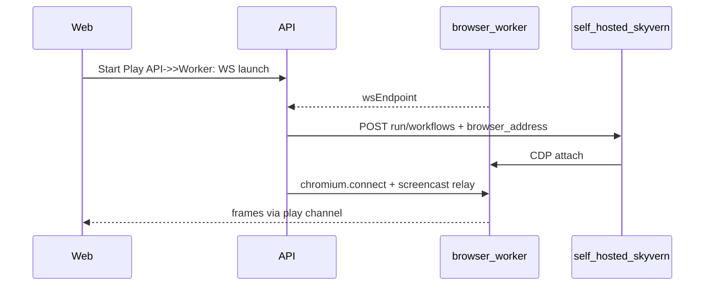

# Navigation detail — Record / Play redesign + Skyvern (worker browser)

Unified plan: **detail page UX**, **API/data fixes**, **Play mode** with **self-hosted Skyvern** driving automation while the **browser runs in our Docker browser-worker** (CDP via Flycast). Assumes Skyvern is **colocated** with the worker so `browser_address` can stay private.

---

## 1. Goals

- From the Navigations list, opening a navigation keeps the same detail route but the page is reorganized:
  - **Top:** Static summary — recording date/time, step count, count of automatic/AI steps, project, auto sign-in, intent/goal, desired output, status (success / error / paused as applicable).
  - **Two primary actions:** **Play** and **Record** (not evaluation-centric copy or disabled run buttons).
- **Record:** Below the goal definitions, keep the **existing** recording experience (`NavigationRecorderLayout`, canvas, timeline). When recording is **paused** in-session, show **Continue recording** when appropriate (key off **live** recording session, not only persisted status — align with AGENTS.md guidance for resumable runs).
- **Play:** New area with the **same class of UX** as recording: canvas/stream, remote browser worker, controls (**play / pause / restart**), and **recorded actions** on the right (read-only during play). Execution is **Skyvern workflow runs** backed by workflow JSON from the DB (create/sync Skyvern workflow as needed).

---

## 2. Current gaps (codebase)

| Area | Issue |
|------|--------|
| [`NavigationsService.findOne`](apps/api/src/modules/navigations/navigations.service.ts) | Returns **`steps: []`**; **`NavigationAction`** rows exist but are not loaded. |
| [`stopSession`](apps/api/src/modules/navigations/navigation-recording.service.ts) | Uses **`createMany`** without clearing prior actions → **duplicate rows** on re-record. |
| **`EvaluationStatus`** | No **`PAUSED`**; pause is in-memory in `NavigationRecordingService` — surface “paused” in UI via session endpoint or equivalent. |
| Skyvern | **`compileToSkyvernWorkflow`** only ([`skyvern-compiler.ts`](apps/api/src/modules/navigations/skyvern-compiler.ts)); no HTTP client, no Play integration. |
| [`NavigationDetail.tsx`](apps/web/src/pages/NavigationDetail.tsx) | Still mirrors **evaluation** UI (thinking process, evaluation timeline, etc.) instead of Record/Play-first layout. |

---

## 3. API and data model

1. **`findOne` / GET navigation by id**  
   - Include **`NavigationAction`** ordered by `sequence` (or equivalent).  
   - Add **aggregates** for summary: total steps, counts by type, last recorded-at if stored, etc.

2. **`stopSession` / re-record**  
   - **Replace** persisted actions for that navigation on stop (e.g. deleteMany + createMany in a transaction, or upsert strategy) so re-recording does not duplicate.

3. **Optional: `skyvern_workflow_id`**  
   - Prisma column on **`Navigation`** (nullable string, Skyvern `wpid_…`) if we persist the remote workflow id after first publish.  
   - Migration from [`apps/api/prisma/`](apps/api/prisma/).

4. **`GET /navigations/:id/recording-session`** (or nested under recordings)  
   - Returns `{ active, paused, ... }` so the web client can show **Continue recording** without guessing from stale status enums alone.

5. **Play session / Skyvern orchestration (new endpoints)**  
   - Acquire **`wsEndpoint`** from browser-worker (reuse [`RecordingService.connectBrowserWorkerWebSocketOnce`](apps/api/src/modules/recording/recording.service.ts) pattern).  
   - Call self-hosted Skyvern **`POST /v1/run/workflows`** with `workflow_id`, `parameters`, and **`browser_address`** (see §5).  
   - Poll run status until terminal; return **`run_id`** and errors to the client.  
   - **Frame relay:** dedicated Socket.IO channel/room for **Play** so it does not collide with an active **Record** session on the same navigation if both are guarded.

---

## 4. Web app

1. **Types** — Extend [`api.ts`](apps/web/src/lib/api.ts) (or equivalent) for navigation detail payload including actions and aggregates.

2. **`NavigationDetail.tsx`**  
   - **Summary header** (§1).  
   - **Record** section: existing [`NavigationRecorderLayout`](apps/web/src/components/navigation/NavigationRecorderLayout.tsx) + hooks.  
   - **Play** section: controls + stream + read-only action list; remove or gate evaluation-only panels (thinking process, etc.).

3. **Play workspace**  
   - Wire to new REST (and socket) endpoints for start/stop/restart.  
   - **Pause** only if Skyvern exposes it; otherwise “stop run” + copy that restart starts a new run.

---

## 5. Play mode — Skyvern + our browser-worker (self-hosted)

**Constraint:** Skyvern **Cloud** cannot attach to private Flycast CDP. This plan assumes **self-hosted Skyvern** next to [`apps/browser-worker`](apps/browser-worker) so **`browser_address`** can be internal (e.g. `ws://…flycast…:3003/…` per [`fly.toml`](apps/browser-worker/fly.toml)).

### 5.1 Environment

- **`SKYVERN_API_KEY`**
- **`SKYVERN_API_BASE_URL`** — your Skyvern deployment, not necessarily `https://api.skyvern.com`.
- Existing **`BROWSER_WORKER_URL`**, **`WORKER_EXTERNAL_HOST`** — unchanged; see [`browser-worker-url.util.ts`](apps/api/src/modules/recording/browser-worker-url.util.ts) and [`server.ts`](apps/browser-worker/server.ts).

### 5.2 Run workflow request

Per [Skyvern OpenAPI — Run a workflow](https://docs-new.skyvern.com/docs/api-reference/workflows/run-a-workflow), **`WorkflowRunRequest`** supports:

- **`browser_address`** — “The CDP address for the workflow run.”
- **`browser_session_id`** — Skyvern-hosted session (omit for our-worker path).

**Implementation notes:**

- Pass the worker **`wsEndpoint`** from Playwright `launchServer` as **`browser_address`** if the self-hosted Skyvern version accepts `ws://…`; if it only accepts HTTP CDP roots (e.g. `http://127.0.0.1:9222`), add a small adapter after validating against your Skyvern build.
- **Spike early:** Can **self-hosted Skyvern** and **Bladerunner** (`chromium.connect` for screencast) attach to the **same** `launchServer` without conflict? If not, fallback: Skyvern-only CDP and use Skyvern’s **`recording_url`** / screenshots for Play, or split instances (worse UX).

### 5.3 Live video

- Prefer reusing the **2-plane architecture** (control WS + CDP) already used for navigation recording — same frame relay path as `NavigationRecordingService` / `RecordingService`, on a **play-specific** channel.

### 5.4 Flow (reference)

---

## 6. Docs and release hygiene

- **README / `.env.example`:** document **`SKYVERN_*`**, self-hosted base URL, and that Play expects private CDP when Skyvern is colocated.
- **CHANGELOG + version bumps** (patch per change) per repo rules when implementing.

---

## 7. Implementation todos

1. **validate-cdp-format** — Spike: `browser_address` format for self-hosted Skyvern; dual CDP clients on one `launchServer`.
2. **api-actions-findone** — Include `NavigationAction` in `findOne` + aggregates; fix `stopSession` replace semantics; optional `skyvern_workflow_id` + migration.
3. **api-recording-session** — `GET …/recording-session` for active/paused; wire **Continue recording** in UI.
4. **api-skyvern-client** — Nest service: create/update workflow, run workflow, poll status.
5. **api-play-session** — Play lifecycle endpoints + play frame-relay room; restart/stop.
6. **web-types-layout** — Types, `NavigationDetail` summary + Record/Play split; trim evaluation-only UI.
7. **web-play-workspace** — Play controls, stream, read-only timeline.
8. **docs-changelog** — Env docs, CHANGELOG, versions.

---

## 8. Out of scope / separate work

- **Navigation Skyvern LLM audit** (usage key `navigation_skyvern_workflow_refinement`) — already shipped; see [`nav_skyvern_llm_audit_ac5a2ab0.plan.md`](nav_skyvern_llm_audit_ac5a2ab0.plan.md) for history only.
